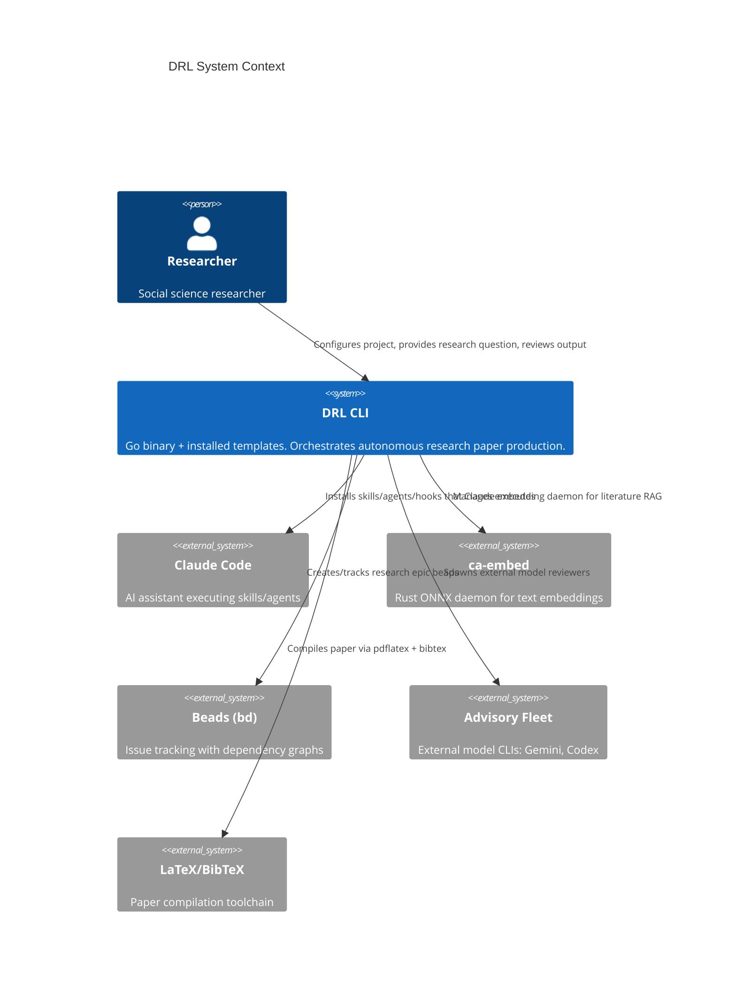
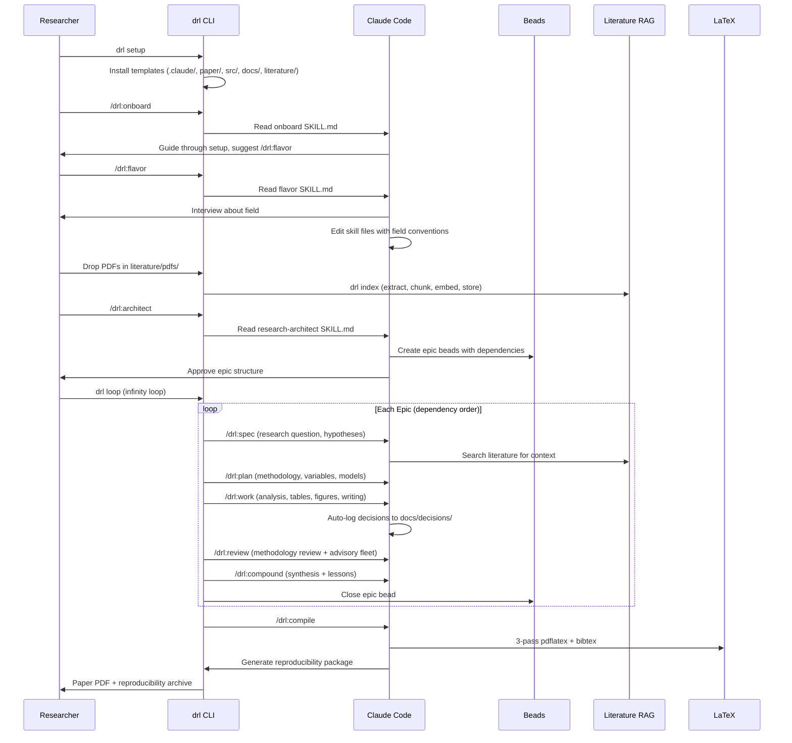

You are a senior quality auditor performing a holistic review of the ENTIRE implementation.
Audit EVERYTHING -- code, architecture, security, testing, error handling, AND user-facing
quality. This is not just a UI checklist. Every dimension matters.

## Your Task
1. Read the codebase thoroughly (source code, tests, config, docs)
2. Evaluate against ALL sections of the quality checklist below
3. Produce a structured report with P0/P1/P2 findings
4. Tag any finding that requires browser/runtime verification with [NEEDS_QA]

## Full-Spectrum Quality Checklist

### 1. Code Quality and Architecture
- [ ] Clean module boundaries -- no circular dependencies, clear responsibilities
- [ ] Consistent naming conventions across the codebase
- [ ] No dead code, unused imports, or commented-out blocks
- [ ] Functions are focused and short (< 50 lines, single responsibility)
- [ ] No code duplication -- shared logic is properly extracted
- [ ] Error handling is consistent and thorough (no swallowed errors)
- [ ] Logging is meaningful (not too verbose, not silent on failures)
- [ ] Configuration is externalized (no hardcoded URLs, keys, or magic numbers)
- [ ] Data flows are clear and traceable

### 2. Security
- [ ] No secrets or credentials in source code
- [ ] Input validation at all system boundaries (forms, APIs, URL params)
- [ ] SQL/NoSQL injection protection (parameterized queries, ORMs)
- [ ] XSS protection (output encoding, CSP headers)
- [ ] Authentication and authorization checks on all protected routes
- [ ] CORS configured correctly (not wildcard in production)
- [ ] Dependencies are up to date (no known CVEs)
- [ ] Sensitive data not logged or exposed in error messages

### 3. Testing
- [ ] Test coverage is meaningful (not just line count -- tests verify behavior)
- [ ] Edge cases are tested (empty input, boundary values, error paths)
- [ ] No flaky tests (tests pass consistently)
- [ ] Integration tests exist for critical paths
- [ ] Tests are independent (no shared mutable state between tests)
- [ ] Test data is realistic (not trivial "foo"/"bar" stubs)
- [ ] Error scenarios are tested (network failures, invalid data, timeouts)

### 4. Error Handling and Resilience
- [ ] User-facing errors are clear and actionable (not stack traces)
- [ ] Network failures are handled gracefully (retry, fallback)
- [ ] Loading states prevent jank and race conditions (if UI)
- [ ] Partial failures don't crash the whole application
- [ ] Timeouts are configured for external calls
- [ ] Validation errors are specific (not just "invalid input")

### 5. Performance
- [ ] No N+1 queries or excessive API calls
- [ ] No memory leaks (event listeners cleaned up, subscriptions unsubscribed)
- [ ] Assets are optimized -- images, fonts, bundles (if web UI)
- [ ] Lazy loading for below-fold content (if web UI)
- [ ] Core Web Vitals: LCP < 2.5s, INP < 200ms, CLS < 0.1 (if web UI)
- [ ] Font loading strategy -- font-display, preload, size-adjust fallbacks (if web UI)
- [ ] Bundle size is reasonable -- tree-shaking, code splitting (if web UI)

### 6. UI States and Interaction (if applicable)
- [ ] 5 states per data view: loading, empty, error, offline, partial data
- [ ] hover/active/focus/disabled states on interactive elements
- [ ] Press feedback within 100ms
- [ ] Validation feedback is inline and immediate
- [ ] Page transitions are smooth and purposeful

### 7. Visual Craft (if applicable)
- [ ] 3+ levels of typography hierarchy (size, weight, color)
- [ ] Geometric spacing scale (4/8/16/24/32/48/64) -- no arbitrary values
- [ ] Semantic color tokens (not raw hex)
- [ ] Consistent icon style and sizing
- [ ] No borders where spacing, background, or shadow would work

### 8. Responsiveness (if applicable)
- [ ] Mobile is first-class (different IA, content priority, interaction patterns)
- [ ] 44x44px minimum touch targets
- [ ] Fluid typography (clamp or viewport units)
- [ ] No horizontal scroll on any breakpoint

### 9. Accessibility (if applicable)
- [ ] Semantic HTML (not div soup)
- [ ] Color contrast meets WCAG AA (4.5:1 for text)
- [ ] Keyboard navigation works (visible focus indicators)
- [ ] ARIA only where semantic HTML is insufficient
- [ ] prefers-reduced-motion respected

### 10. Common AI Laziness Anti-Patterns
- [ ] NOT shallow implementations -- deep interfaces, not pass-through wrappers
- [ ] NOT generic/placeholder code -- curated, specific, deliberate
- [ ] NOT skipping error paths -- error handling is a first-class feature
- [ ] NOT missing edge cases -- boundary conditions are designed, not discovered
- [ ] NOT flat interactions -- every user action needs feedback
- [ ] NOT arbitrary spacing or magic numbers
- [ ] NOT ignoring mobile/responsive
- [ ] NOT test-after or tests that just assert "it exists"

## Visual Verification (Self-Serve)

Before reviewing code, check whether the project has a runnable UI. You should visually
verify what users actually see, not just read the source.

### Auto-Detection (check in order, stop at first match)
1. package.json with "dev" or "start" script --> npm/pnpm/yarn run dev
   Default ports: vite.config.* (5173), next.config.* (3000), nuxt.config.* (3000), angular.json (4200), svelte.config.* (5173)
2. manage.py --> Django (port 8000)
3. app.py or main.py with Flask/FastAPI imports --> port 5000 or 8000
4. Go main.go with http.ListenAndServe --> port 8080
5. Static index.html without framework --> python3 -m http.server 8000
6. None of the above --> skip visual verification entirely (no UI to screenshot)

### If UI Detected
1. Start the dev server in the background. Wait for HTTP 200 on the root path (poll every 1s, timeout 30s). If the server fails to start within the timeout, skip visual verification and tag visual findings with [NEEDS_QA].
2. Use Playwright (headless Chromium) to take full-page screenshots at 4 viewports:
   - 375px (mobile), 768px (tablet), 1024px (small desktop), 1440px (desktop)
3. Navigate to key routes (up to 10 -- check router config, nav links, or page files) and screenshot each.
4. Critique the screenshots as part of your audit:
   - Layout alignment and spacing consistency across viewports
   - Typography hierarchy and readability (contrast, size, truncation)
   - Responsive behavior (does mobile get a real layout, not shrunken desktop?)
   - Visual states visible on the page (empty states, loading indicators, error handling)
   - Design system consistency (are colors, spacing, and components coherent?)
5. Save screenshots to the cycle directory with descriptive names (e.g., homepage-375.png, mixer-1440.png).
6. Include visual findings in your P0/P1/P2 report with screenshot references as evidence.
7. Stop the dev server when done.

### If Playwright Is Unavailable
If you cannot install or run Playwright, record a P3/INFO finding ("Playwright not available
for visual verification") and skip this section. Tag any visual concern with [NEEDS_QA] so
the polish architect routes it to the QA Engineer for hands-on testing.

### If No UI Detected
Skip this section entirely. Not every project has a visual interface -- APIs, CLIs, and
libraries do not need visual verification. Focus on code quality, testing, and architecture.

## Browser Verification (QA Engineer)

For any finding that requires runtime verification to confirm (visual bugs, interaction
issues, responsive problems, accessibility failures, performance bottlenecks visible at
runtime), tag it with [NEEDS_QA]. The polish architect will route these to the QA Engineer
skill (`.claude/skills/compound/qa-engineer/SKILL.md`) which performs hands-on browser
automation testing: screenshots, exploratory testing, boundary inputs, accessibility checks,
network inspection, and viewport stress testing against the running application.

Examples of [NEEDS_QA] findings:
- "Mobile layout breaks at 375px [NEEDS_QA]"
- "Form validation not visible on submit [NEEDS_QA]"
- "No loading skeleton while data fetches [NEEDS_QA]"
- "Contrast ratio may fail WCAG AA on the dashboard header [NEEDS_QA]"

## Output Format
Structure your report as:

### P0 -- Must Fix (blocks quality)
- Finding description with file/line references (add [NEEDS_QA] if runtime verification needed)

### P1 -- Should Fix (significant quality gap)
- Finding description with file/line references (add [NEEDS_QA] if runtime verification needed)

### P2 -- Nice to Fix (polish opportunity)
- Finding description with file/line references (add [NEEDS_QA] if runtime verification needed)

### Summary
- Overall assessment across all dimensions (1-2 sentences)
- Top 3 highest-impact improvements
- Count of [NEEDS_QA] findings that require browser verification

## Spec Context
# DRL Package -- System Specification

*Date: 2026-04-02*
*Status: Draft*

## 1. System Overview

The Dark Research Lab (DRL) is a pnpm-distributed CLI tool that turns any git repository into an autonomous research paper factory. It ships as a Go binary (`drl`) forked from compound-agent (`ca`), with embedded templates that `drl setup` installs into a project.

**Primary actor**: A single social science researcher.
**System boundary**: The `drl` CLI + installed template files (skills, agents, commands, hooks, scaffolding).

---

## 2. EARS Requirements

### 2.1 Ubiquitous (always true)

- **U1**: The DRL CLI SHALL be distributed as a pnpm package containing a platform-specific Go binary named `drl`.
- **U2**: All slash commands SHALL use the `/drl:*` namespace.
- **U3**: All skill files SHALL follow the skill-as-instruction-file pattern (thin command wrapper -> Read SKILL.md).
- **U4**: The system SHALL preserve all compound-agent subsystems: memory (JSONL), lessons, knowledge (SQLite FTS5), search (ca-embed), beads (bd), hooks, infinity loop.
- **U5**: Every methodological decision made during research work SHALL be logged to `docs/decisions/`.
- **U6**: The system SHALL auto-generate a reproducibility package (uv.lock + data manifest + run script + env spec) at paper compilation time.

### 2.2 Event-Driven

- **E1**: WHEN `drl setup` is executed, the system SHALL install all template files (.claude/, paper/, src/, docs/, literature/, tests/, AGENTS.md) into the current repository.
- **E2**: WHEN a new PDF is added to `literature/pdfs/`, the system SHALL extract text, chunk, embed (via ca-embed), and index it in SQLite FTS5 + vector store.
- **E3**: WHEN a cook-it phase transition occurs, the system SHALL inject a reminder to log any pending methodological decisions.
- **E4**: WHEN `/drl:flavor` is invoked, the system SHALL interview the researcher about their field and directly edit skill files to customize methodology vocabulary, evidence standards, and writing conventions.
- **E5**: WHEN `/drl:compile` is invoked, the system SHALL run 3-pass pdflatex + bibtex, generate reproducibility package, and report any unresolved references or missing figures.
- **E6**: WHEN `/drl:onboard` is invoked, the system SHALL guide the researcher through project setup, suggest `/drl:flavor`, and explain the framework structure.

### 2.3 State-Driven

- **S1**: WHILE in the research-work phase, the system SHALL auto-log decisions to `docs/decisions/` and write agent progress notes to `docs/agent_notes/`.
- **S2**: WHILE the phase guard is active, the system SHALL block Edit/Write tool calls if the current phase's SKILL.md has not been read.
- **S3**: WHILE the infinity loop is running, the system SHALL process epic beads in dependency order, each through the full cook-it cycle.

### 2.4 Unwanted Behavior

- **W1**: IF the researcher attempts to run analysis without a research-spec approved, THEN the system SHALL block and prompt for spec completion.
- **W2**: IF a literature search returns zero results for a key claim, THEN the system SHALL flag the claim as unsupported in the methodology review.
- **W3**: IF LaTeX compilation fails, THEN the system SHALL report specific errors and not mark the synthesis phase as complete.

### 2.5 Optional

- **O1**: WHERE the researcher has provided field-specific flavor configuration, the system SHALL use adapted vocabulary, evidence standards, and citation style in all generated content.
- **O2**: WHERE external model CLIs are available (gemini, codex), the system SHALL include them in the advisory fleet during review phases.

---

## 3. Architecture Diagrams

### 3.1 C4 Context

### 3.2 Sequence: Full Research Cycle

### 3.3 State: Cook-It Cycle (Research-Adapted)

```mermaid
stateDiagram-v2
    [*] --> ResearchSpec: /drl:spec
    ResearchSpec --> ResearchPlan: Spec approved
    ResearchPlan --> ResearchWork: Plan approved
    ResearchWork --> MethodologyReview: Analysis complete
    MethodologyReview --> Synthesis: Review passes
    MethodologyReview --> ResearchWork: Review fails (rework)
    Synthesis --> [*]: Paper section complete

    state ResearchSpec {
        [*] --> DefineRQ: Define research question
        DefineRQ --> StateHypotheses: RQ clear
        StateHypotheses --> LitGap: Hypotheses stated
        LitGap --> SpecGate: Gap identified
        SpecGate --> [*]: Human approves
    }

    state ResearchWork {
        [*] --> RunAnalysis
        RunAnalysis --> GenerateOutputs: Analysis done
        GenerateOutputs --> WriteSections: Tables/figures ready
        WriteSections --> LogDecisions: Sections drafted
        LogDecisions --> [*]: All planned work complete
    }

    state MethodologyReview {
        [*] --> StatisticalCheck
        StatisticalCheck --> LogicalCheck
        LogicalCheck --> CitationCheck
        CitationCheck --> ReproCheck
        ReproCheck --> WritingCheck
        WritingCheck --> [*]: All checks pass/fail
    }
```

---

## 4. Scenario Table

| ID | Scenario | EARS Req | Expected Outcome |
|---|---|---|---|
| SC1 | Researcher runs `drl setup` in empty repo | E1 | All template dirs/files created |
| SC2 | Researcher drops 5 PDFs and runs `drl index` | E2 | PDFs extracted, chunked, embedded, searchable via `drl knowledge` |
| SC3 | Agent searches literature for "wage elasticity" | E2, S1 | Returns relevant passages from indexed PDFs |
| SC4 | Agent makes a variable selection during work phase | U5, S1, E3 | Decision logged to docs/decisions/, reminder shown at next phase |
| SC5 | Full cook-it cycle on one epic | S3, U3 | 5 phases execute in order, phase guard enforced |
| SC6 | `/drl:flavor` for labor economics | E4, O1 | Skills updated with labor econ vocabulary and conventions |
| SC7 | `/drl:compile` with missing figure | W3 | Compilation fails, specific error reported |
| SC8 | `/drl:compile` succeeds | E5, U6 | PDF generated, reproducibility package created |
| SC9 | Infinity loop processes 6 epics | S3, U4 | Epics processed in dependency order, each through cook-it |
| SC10 | Phase guard blocks edit before skill read | S2 | Edit/Write rejected with guidance to read skill first |

---

## 5. Delivery Profile

**Advisory**: This system maps to a `cli` + `template-package` delivery shape. The Go binary is a CLI tool; the primary output is template files installed into target repos.

---

## 6. Meta

- **Source synthesis**: `docs/exploration/SYNTHESIS.md`
- **Architecture decisions**: 18 decisions locked in during exploration (2026-04-02)
- **Launch intent**: Infinity loop, all reviewers, 3 polish cycles

## Cycle
This is polish cycle 2 of 3.
