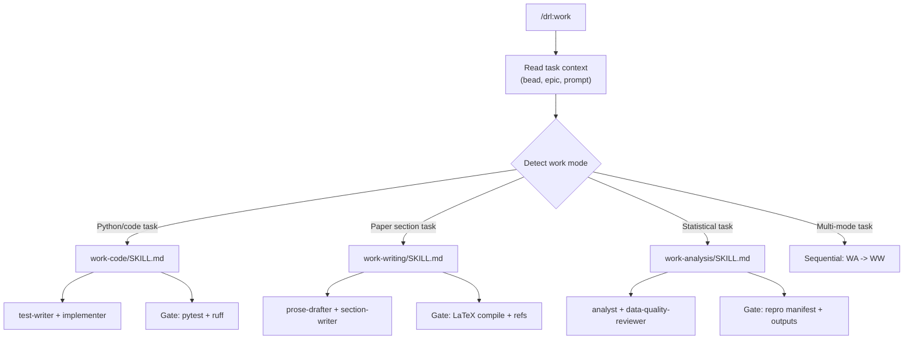
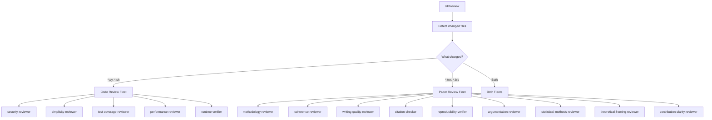
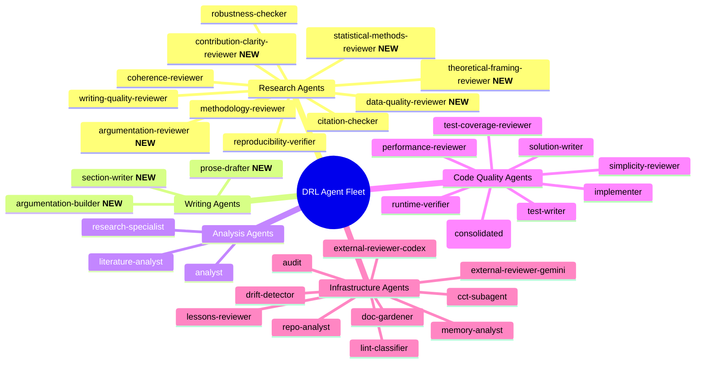

# DRL Content Migration -- System Specification

*Date: 2026-04-04*
*Status: Draft*
*Parent: drl-package.md*

## 1. Problem Statement

DRL ships compound-agent infrastructure rebranded for research, but the content layer (agents, agent-role skills, knowledge base, work modes, verification gates) remains software-engineering-focused. The agent fleet is 64% code-oriented. The knowledge base contains zero social science methodology content. The work phase has only one mode (TDD code). The review fleet runs code audits, not methodology reviews. Stale compound-agent artifacts ship alongside DRL commands.

**Goal**: Transform DRL from a code factory wearing a lab coat into a genuine research operating system, while preserving production-quality code capabilities for the Python analysis pipeline.

**Target user**: Social science researchers who write Python for data analysis but whose primary output is a research paper, not production software.

---

## 2. EARS Requirements

### 2.1 Work Skill Refactoring

- **R1** (Event-driven): WHEN the work skill is invoked, the system SHALL read the current task context (bead description, epic notes, or user prompt) and select the appropriate work sub-skill(s) from: `work-code`, `work-writing`, `work-analysis`.
- **R2** (Ubiquitous): Each work sub-skill SHALL be a separate SKILL.md file under `skills/work-code/`, `skills/work-writing/`, `skills/work-analysis/`.
- **R3** (Event-driven): WHEN the selected work mode is `work-code`, the system SHALL delegate to test-writer + implementer agents with pytest/ruff verification gates.
- **R4** (Event-driven): WHEN the selected work mode is `work-writing`, the system SHALL delegate to prose-drafter + section-writer agents with LaTeX compilation verification gates.
- **R5** (Event-driven): WHEN the selected work mode is `work-analysis`, the system SHALL delegate to analyst + data-quality-reviewer agents with reproducibility + table generation verification gates.
- **R6** (Event-driven): WHEN a single task requires multiple work modes (e.g., run regression then write results section), the work skill SHALL invoke multiple sub-skills sequentially within the same session.

### 2.2 New Writing Agents

- **R7** (Ubiquitous): The system SHALL include 3 writing-focused agents, each defined as BOTH a subagent definition (`agents/`) AND an agent-role skill (`agent-role-skills/`):
  - `prose-drafter`: Drafts academic prose sections following journal conventions
  - `section-writer`: Writes specific paper sections (intro, results, conclusion) referencing outputs in `paper/outputs/`
  - `argumentation-builder`: Constructs logical argument chains connecting hypotheses to evidence

### 2.3 New Research Agents

- **R8** (Ubiquitous): The system SHALL include 5 research-focused agents, each defined as BOTH a subagent definition (`agents/`) AND an agent-role skill (`agent-role-skills/`):
  - `argumentation-reviewer`: Reviews logical coherence of claims, evidence chains, and counterargument handling
  - `statistical-methods-reviewer`: Audits statistical method selection, assumption testing, and result interpretation
  - `data-quality-reviewer`: Validates data cleaning decisions, missing data handling, outlier treatment, and sample representativeness
  - `theoretical-framing-reviewer`: Evaluates theoretical framework alignment with RQ, hypothesis grounding, and literature positioning
  - `contribution-clarity-reviewer`: Assesses novelty claims, gap statement strength, and positioning relative to prior work

### 2.4 Security Agent Consolidation

- **R9** (Ubiquitous): The 5 security agent-role skills (security-auth, security-data, security-deps, security-injection, security-secrets) SHALL be consolidated into a single `security-reviewer` agent-role skill covering all security concerns.
- **R10** (Event-driven): WHEN the security-reviewer agent-role is loaded, it SHALL cover: PII/anonymization, dependency reproducibility, credential exposure, injection risks, and access controls in a single review pass.

### 2.5 Review Skill Dual-Mode

- **R11** (Event-driven): WHEN the review skill is invoked, the system SHALL auto-detect the review mode based on what changed since the last review:
  - If Python/code files changed: spawn code-review fleet
  - If LaTeX/paper files changed: spawn paper-review fleet
  - If both changed: spawn both fleets
- **R12** (Ubiquitous): The code-review fleet SHALL include: security-reviewer, simplicity-reviewer, test-coverage-reviewer, performance-reviewer, runtime-verifier.
- **R13** (Ubiquitous): The paper-review fleet SHALL include: methodology-reviewer, coherence-reviewer, writing-quality-reviewer, citation-checker, reproducibility-verifier, argumentation-reviewer, statistical-methods-reviewer, theoretical-framing-reviewer, contribution-clarity-reviewer.

### 2.6 Phase-Aware Verification Gates

- **R14** (State-driven): WHILE executing a `work-code` sub-skill, the verification gate SHALL check: tests pass (`{{QUALITY_GATE_TEST}}`), linter passes (`{{QUALITY_GATE_LINT}}`).
- **R15** (State-driven): WHILE executing a `work-writing` sub-skill, the verification gate SHALL check: LaTeX compiles without errors (`paper/compile.sh`), no unresolved `\ref{}` or `\cite{}` references.
- **R16** (State-driven): WHILE executing a `work-analysis` sub-skill, the verification gate SHALL check: reproducibility manifest updated (`src/orchestrators/repro.py`), output tables/figures generated in `paper/outputs/`.
- **R17** (Unwanted): IF a verification gate fails, THEN the system SHALL report the specific failure and loop back to fix before proceeding.

### 2.7 Social Science Knowledge Base

- **R18** (Ubiquitous): The system SHALL ship 5-8 core social science methodology documents in `docs/research/social_science/`, covering at minimum:
  1. Econometrics fundamentals (OLS, panel, time-series)
  2. Causal inference strategies (IV, DiD, RDD, matching)
  3. Robustness check catalog (sensitivity analysis, alternative specifications)
  4. Academic writing conventions (section structure, argumentation patterns, hedging)
  5. Common identification strategies and threats to validity
- **R19** (Ubiquitous): The existing software-focused knowledge docs SHALL remain (useful for analysis code quality). The social science docs SHALL be additive.
- **R20** (Ubiquitous): The research index (`docs/research/index.md`) SHALL be updated to map new social science docs to the research agents and work-writing/work-analysis skills.

### 2.8 Compound-Agent Legacy Removal

- **R21** (Ubiquitous): The shipped product SHALL NOT include any `compound/*` namespace commands or skills. Only `drl/*` namespace artifacts SHALL be installed.
- **R22** (Event-driven): WHEN `drl setup` is executed, IF stale `compound/*` artifacts exist in the target project, the system SHALL remove them (via the existing `PruneStaleTemplates` mechanism).
- **R23** (Ubiquitous): The Phase 5 skill named "compound" (lesson synthesis) SHALL remain -- it is DRL-native, not a compound-agent artifact.

### 2.9 Research Onboarding Guide

- **R24** (Ubiquitous): The system SHALL ship a research onboarding document (`docs/ONBOARDING.md`) that walks through the end-to-end flow: research question -> `/drl:spec-dev` -> `/drl:plan` -> `/drl:architect` -> infinity loop -> `/drl:compile` -> polished paper.
- **R25** (Ubiquitous): The onboarding guide SHALL describe session types (literature, spec, methodology, analysis, writing, review, synthesis) and when to use each.

### 2.10 Data Directory Scaffolding

- **R26** (Event-driven): WHEN `drl setup` scaffolds a new project, the system SHALL create a `data/` directory with `data/input/` and `data/output/` subdirectories (with `.gitkeep` placeholders).
- **R27** (Ubiquitous): The data directory structure SHALL be documented in the onboarding guide and referenced by the `work-analysis` sub-skill as the default data location.

### 2.11 Literature Review as Callable Skill

- **R28** (Ubiquitous): The lit-review skill SHALL remain a standalone command (`/drl:lit-review`) with a clear description of when to invoke it.
- **R29** (Event-driven): WHEN the `work-writing` sub-skill needs literature context, the agent SHALL reference the lit-review skill description to understand how to pull literature -- but this is a manual agent decision, NOT an automatic trigger.

---

## 3. Architecture Diagrams

### 3.1 Work Skill Routing

### 3.2 Review Dual-Mode

### 3.3 Agent Fleet Inventory (Post-Migration)

---

## 4. Scenario Table

| ID | Source | Category | Precondition | Trigger | Expected Outcome |
|----|--------|----------|--------------|---------|------------------|
| S1 | R1 | happy | Bead describes "run OLS regression on dataset" | `/drl:work` invoked | Work skill selects `work-analysis` sub-skill |
| S2 | R1 | happy | Bead describes "write introduction section" | `/drl:work` invoked | Work skill selects `work-writing` sub-skill |
| S3 | R1 | happy | Bead describes "implement data loader function" | `/drl:work` invoked | Work skill selects `work-code` sub-skill |
| S4 | R6 | happy | Bead describes "run regression and write results" | `/drl:work` invoked | Work skill invokes `work-analysis` then `work-writing` sequentially |
| S5 | R1 | error | Bead description is ambiguous | `/drl:work` invoked | Work skill asks user via `AskUserQuestion` to clarify mode |
| S6 | R7 | happy | `work-writing` active, intro section task | Agent delegation | `prose-drafter` and `section-writer` agents spawned |
| S7 | R8 | happy | Paper review mode active | Review fleet spawned | All 9 paper reviewers run in parallel |
| S8 | R11 | happy | Only `*.tex` files changed | `/drl:review` invoked | Only paper-review fleet spawns |
| S9 | R11 | happy | Both `*.py` and `*.tex` changed | `/drl:review` invoked | Both code and paper review fleets spawn |
| S10 | R11 | boundary | No files changed | `/drl:review` invoked | System reports "nothing to review" |
| S11 | R14 | happy | `work-code` complete, tests pass | Verification gate | Gate passes, work proceeds |
| S12 | R15 | error | `work-writing` complete, LaTeX has `\ref{missing}` | Verification gate | Gate fails, reports unresolved reference |
| S13 | R16 | happy | `work-analysis` complete, tables generated | Verification gate | Gate passes after repro manifest updated |
| S14 | R17 | error | Any gate fails | Gate check | System reports failure, loops back |
| S15 | R9 | happy | Code review mode | Security review | Single consolidated `security-reviewer` covers all concerns |
| S16 | R21 | happy | Fresh `drl setup` | Installation | No `compound/*` commands or skills installed |
| S17 | R22 | happy | Existing project has `compound/*` | `drl setup` re-run | Stale `compound/*` artifacts pruned |
| S18 | R23 | happy | Phase 5 invoked | `/drl:compound` | Phase 5 compound (lesson synthesis) works normally |
| S19 | R26 | happy | Fresh `drl setup` | Project scaffolded | `data/input/` and `data/output/` created with `.gitkeep` |
| S20 | R18 | happy | Agent needs methodology context | `drl knowledge "causal inference"` | Returns social science docs from knowledge base |
| S21 | R29 | happy | Writing agent needs literature context | Agent reads lit-review skill description | Agent understands how to invoke lit-review manually |
| S22 | R24 | happy | New researcher installs DRL | Reads `docs/ONBOARDING.md` | Understands end-to-end flow from RQ to paper |
| S23 | R19 | happy | Agent needs code best practices | `drl knowledge "testing patterns"` | Existing software docs still returned |
| S24 | R8 | adversarial | Theoretical framing reviewer finds no cited theory | Review | Flags missing theoretical grounding, does not pass |

---

## 5. Surfaces and Risks

### 5.1 Touched Surfaces

| Surface | Type | Risk Level |
|---------|------|------------|
| `go/internal/setup/templates/skills/` | Template files | Medium -- new skill files, restructured work skill |
| `go/internal/setup/templates/agents/` | Template files | Medium -- 8 new agent definitions |
| `go/internal/setup/templates/agent-role-skills/` | Template files | Medium -- 8 new + 5 removed (security consolidation) + restructured |
| `go/internal/setup/templates/docs/research/` | Knowledge docs | Low -- additive, no existing content removed |
| `go/internal/setup/templates/scaffolding/` | Project templates | Low -- adding `data/` directory |
| `go/internal/setup/templates/embed.go` | Go embed directives | Medium -- must register new directories |
| `go/internal/setup/init.go` | Setup logic | Medium -- must handle compound/* pruning |
| `go/internal/setup/templates/docs/` | Documentation | Low -- new ONBOARDING.md |
| Integration tests | Go tests | Medium -- must verify new templates compile and embed |
| `go/internal/setup/templates/skills/review/SKILL.md` | Existing skill | High -- significant refactor for dual-mode |
| `go/internal/setup/templates/skills/work/SKILL.md` | Existing skill | High -- becomes a router, delegates to sub-skills |

### 5.2 Risks

| Risk | Likelihood | Impact | Mitigation |
|------|-----------|--------|------------|
| Work skill routing picks wrong mode | Medium | Medium | Clear heuristics + fallback to `AskUserQuestion` |
| Flavor edits break with new skill structure | Medium | High | Update flavor skill to know about work sub-skills |
| Embed.go misses new directories | Low | High | Integration tests verify all templates embedded |
| Knowledge docs too generic to be useful | Medium | Medium | Ground in concrete examples (sample datasets, regressions) |
| Review fleet too large (13 paper reviewers) | Low | Medium | Each reviewer self-skips if nothing relevant |

---

## 6. Resolved Questions

1. **Cook-it and work sub-skills**: Cook-it simply invokes `/drl:work`. The routing happens inside the work skill itself. No changes to cook-it needed.
2. **Flavor and new skills**: Flavor can modify any skill the user asks it to. No special discovery mechanism — flavor edits whatever skills are requested during the interview.
3. **Removed security specializations**: Delete from `go/internal/setup/templates/`. Clean removal, no archival.
4. **skills_index.json and sub-skills**: No changes needed — auto-generation handles it.

---

## 7. Glossary

| Term | Definition | Operationalization |
|------|-----------|-------------------|
| Work sub-skill | A specialized SKILL.md that guides a specific type of work (code, writing, analysis) | Separate file under `skills/work-*/SKILL.md` |
| Work routing | The process by which the work skill reads task context and selects sub-skill(s) | Heuristic matching on bead description keywords + file types |
| Code-review fleet | Set of agents that review Python/code changes | security-reviewer, simplicity-reviewer, test-coverage-reviewer, performance-reviewer, runtime-verifier |
| Paper-review fleet | Set of agents that review LaTeX/paper changes | 9 research-focused reviewers (see R13) |
| Verification gate | Phase-specific check that must pass before work is considered complete | pytest/ruff for code, compile.sh for writing, repro.py for analysis |
| Knowledge base | Embedded research documents searchable via `drl knowledge` | Markdown docs in `docs/research/` indexed by SQLite FTS5 |
| Compound pruning | Removal of stale compound-agent namespace artifacts | `PruneStaleTemplates` function in Go setup code |
