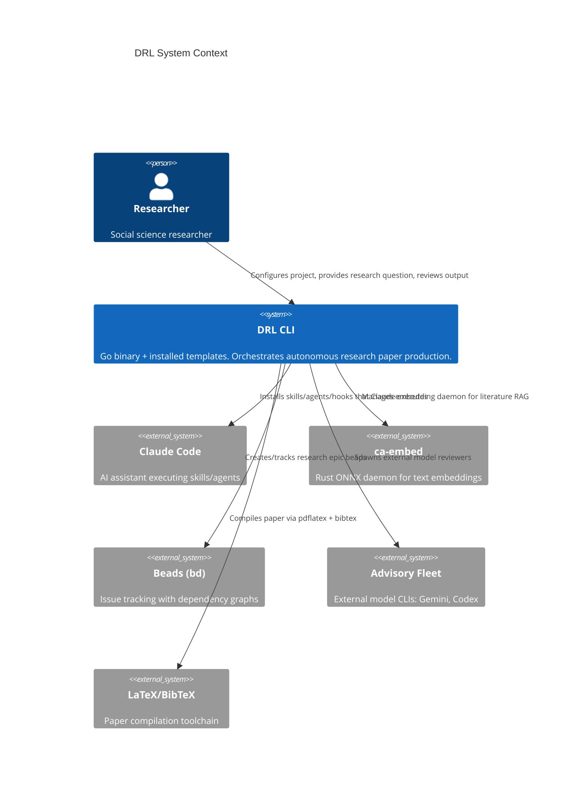
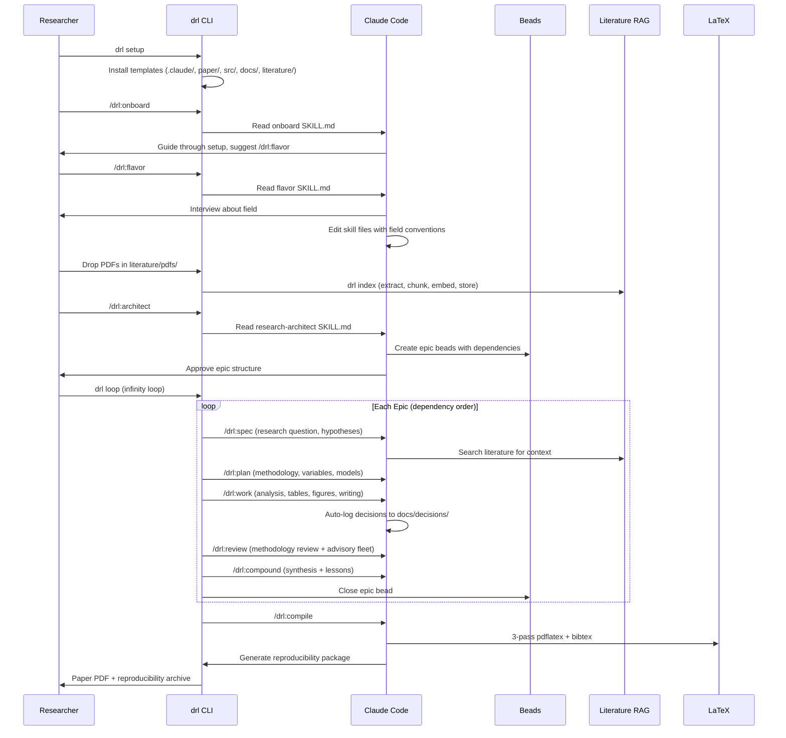

# DRL Package -- System Specification

*Date: 2026-04-02*
*Status: Active*

## 1. System Overview

The Dark Research Lab (DRL) is a PyPI-distributed CLI tool that turns any git repository into an autonomous research paper factory. It ships as a Go binary (`drl`) forked from compound-agent (`ca`), packaged inside platform-specific Python wheels (same pattern as ruff/uv). Install: `uv pip install dark-research-lab`. The Go binary embeds all templates that `drl setup` installs into a project.

**Primary actor**: A single social science researcher.
**System boundary**: The `drl` CLI + installed template files (skills, agents, commands, hooks, scaffolding).

---

## 2. EARS Requirements

### 2.1 Ubiquitous (always true)

- **U1**: The DRL CLI SHALL be distributed as a PyPI package containing a platform-specific Go binary named `drl`, installable via `uv pip install dark-research-lab`.
- **U2**: All slash commands SHALL use the `/drl:*` namespace.
- **U3**: All skill files SHALL follow the skill-as-instruction-file pattern (thin command wrapper -> Read SKILL.md).
- **U4**: The system SHALL preserve all compound-agent subsystems: memory (JSONL), lessons, knowledge (SQLite FTS5), search (ca-embed), beads (bd), hooks, infinity loop.
- **U5**: Every methodological decision made during research work SHALL be logged to `docs/decisions/`.
- **U6**: The system SHALL auto-generate a reproducibility package (uv.lock + data manifest + run script + env spec) at paper compilation time.

### 2.2 Event-Driven

- **E1**: WHEN `drl setup` is executed in an empty repo, the system SHALL install ALL template files (.claude/, paper/, src/, docs/, literature/, tests/, AGENTS.md). WHEN executed in an existing DRL repo, the system SHALL update only infrastructure (hooks, config, scaffolding, commands) and preserve skill/agent customizations.
- **E1a**: WHEN `drl setup --core-skill` is executed, the system SHALL additionally update core workflow skills (architect, spec, plan, work, review, synthesis, flavor, onboard) and core agents (analyst, reproducibility-verifier), preserving style-sensitive skills/agents.
- **E1b**: WHEN `drl setup --all-skill` is executed, the system SHALL update ALL skills and agents, overwriting any flavor customizations.
- **E2**: WHEN a new PDF is added to `literature/pdfs/`, the system SHALL extract text, chunk, embed (via ca-embed), and index it in SQLite FTS5 + vector store.
- **E3**: WHEN a cook-it phase transition occurs, the system SHALL inject a reminder to log any pending methodological decisions.
- **E4**: WHEN `/drl:flavor` is invoked, the system SHALL interview the researcher about their field and directly edit skill files to customize methodology vocabulary, evidence standards, and writing conventions.
- **E5**: WHEN `/drl:compile` is invoked, the system SHALL run 3-pass pdflatex + bibtex, generate reproducibility package, and report any unresolved references or missing figures.
- **E6**: WHEN `/drl:onboard` is invoked, the system SHALL guide the researcher through project setup, suggest `/drl:flavor`, and explain the framework structure.

### 2.3 State-Driven

- **S1**: WHILE in the research-work phase, the system SHALL auto-log decisions to `docs/decisions/` and write agent progress notes to `docs/agent_notes/`.
- **S2**: WHILE the phase guard is active, the system SHALL block Edit/Write tool calls if the current phase's SKILL.md has not been read.
- **S3**: WHILE the infinity loop is running, the system SHALL process epic beads in dependency order, each through the full cook-it cycle.

### 2.4 Unwanted Behavior

- **W1**: IF the researcher attempts to run analysis without a research-spec approved, THEN the system SHALL block and prompt for spec completion.
- **W2**: IF a literature search returns zero results for a key claim, THEN the system SHALL flag the claim as unsupported in the methodology review.
- **W3**: IF LaTeX compilation fails, THEN the system SHALL report specific errors and not mark the synthesis phase as complete.

### 2.5 Optional

- **O1**: WHERE the researcher has provided field-specific flavor configuration, the system SHALL use adapted vocabulary, evidence standards, and citation style in all generated content.
- **O2**: WHERE external model CLIs are available (gemini, codex), the system SHALL include them in the advisory fleet during review phases.

---

## 3. Architecture Diagrams

### 3.1 C4 Context

### 3.2 Sequence: Full Research Cycle

### 3.3 State: Cook-It Cycle (Research-Adapted)

```mermaid
stateDiagram-v2
    [*] --> ResearchSpec: /drl:spec
    ResearchSpec --> ResearchPlan: Spec approved
    ResearchPlan --> ResearchWork: Plan approved
    ResearchWork --> MethodologyReview: Analysis complete
    MethodologyReview --> Synthesis: Review passes
    MethodologyReview --> ResearchWork: Review fails (rework)
    Synthesis --> [*]: Paper section complete

    state ResearchSpec {
        [*] --> DefineRQ: Define research question
        DefineRQ --> StateHypotheses: RQ clear
        StateHypotheses --> LitGap: Hypotheses stated
        LitGap --> SpecGate: Gap identified
        SpecGate --> [*]: Human approves
    }

    state ResearchWork {
        [*] --> RunAnalysis
        RunAnalysis --> GenerateOutputs: Analysis done
        GenerateOutputs --> WriteSections: Tables/figures ready
        WriteSections --> LogDecisions: Sections drafted
        LogDecisions --> [*]: All planned work complete
    }

    state MethodologyReview {
        [*] --> StatisticalCheck
        StatisticalCheck --> LogicalCheck
        LogicalCheck --> CitationCheck
        CitationCheck --> ReproCheck
        ReproCheck --> WritingCheck
        WritingCheck --> [*]: All checks pass/fail
    }
```

---

## 4. Scenario Table

| ID | Scenario | EARS Req | Expected Outcome |
|---|---|---|---|
| SC1 | Researcher runs `drl setup` in empty repo | E1 | All template dirs/files created |
| SC2 | Researcher drops 5 PDFs and runs `drl index` | E2 | PDFs extracted, chunked, embedded, searchable via `drl knowledge` |
| SC3 | Agent searches literature for "wage elasticity" | E2, S1 | Returns relevant passages from indexed PDFs |
| SC4 | Agent makes a variable selection during work phase | U5, S1, E3 | Decision logged to docs/decisions/, reminder shown at next phase |
| SC5 | Full cook-it cycle on one epic | S3, U3 | 5 phases execute in order, phase guard enforced |
| SC6 | `/drl:flavor` for labor economics | E4, O1 | Skills updated with labor econ vocabulary and conventions |
| SC7 | `/drl:compile` with missing figure | W3 | Compilation fails, specific error reported |
| SC8 | `/drl:compile` succeeds | E5, U6 | PDF generated, reproducibility package created |
| SC9 | Infinity loop processes 6 epics | S3, U4 | Epics processed in dependency order, each through cook-it |
| SC10 | Phase guard blocks edit before skill read | S2 | Edit/Write rejected with guidance to read skill first |

---

## 5. Delivery Profile

**Advisory**: This system maps to a `cli` + `template-package` delivery shape. The Go binary is a CLI tool; the primary output is template files installed into target repos.

---

## 6. Meta

- **Source synthesis**: `docs/exploration/SYNTHESIS.md`
- **Architecture decisions**: 18 decisions locked in during exploration (2026-04-02)
- **Launch intent**: Infinity loop, all reviewers, 3 polish cycles
