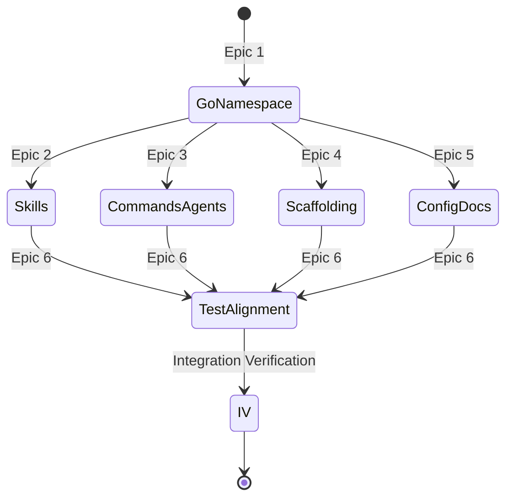

# Template Migration -- System Specification

*Date: 2026-04-03*
*Status: Completed*
*Parent spec: docs/specs/drl-package.md*

## 1. Problem Statement

`drl setup` currently installs compound-agent content (software development skills, agents, commands) instead of DRL research content. The Go binary's templates (`go/internal/setup/templates/`) were forked from compound-agent and never rewritten. DRL-specific content exists only as development tooling in the repo's `.claude/` directory.

**Primary actor**: The DRL developer (Nathan).
**System boundary**: `go/internal/setup/templates/`, Go source code paths, test suite.

---

## 2. EARS Requirements

### 2.1 Ubiquitous

- **U1**: All template install paths SHALL use the `drl` namespace (`.claude/{skills,agents,commands}/drl/`), not `compound`.
- **U2**: All shipped command files SHALL use the `/drl:*` namespace.
- **U3**: The Go binary phase names (`spec-dev`, `plan`, `work`, `review`, `compound`, `architect`) SHALL remain unchanged. DRL skills map phase names internally.
- **U4**: DRL SHALL ship all 13 research skills + 6 adapted infrastructure skills.
- **U5**: DRL SHALL ship 8 research agents + 11 infrastructure agents.
- **U6**: DRL SHALL ship research scaffolding (paper/, src/, literature/, docs/) as embedded templates.
- **U7**: Existing software-dev research docs SHALL be kept under `docs/drl/reference/`.

### 2.2 Event-Driven

- **E1**: WHEN `drl setup` is executed on an empty repo, the system SHALL install DRL research templates (not compound-agent software dev templates).
- **E2**: WHEN the Go binary generates infinity loop scripts, they SHALL reference `/drl:cook-it`, not `/compound:cook-it`.
- **E3**: WHEN the phase guard hook resolves skill paths, it SHALL look in `.claude/skills/drl/`, not `.claude/skills/compound/`.

### 2.3 State-Driven

- **S1**: WHILE the test suite runs, all assertions SHALL validate DRL namespace and content.
- **S2**: WHILE the `test/` fixture exists, it SHALL mirror what `drl setup` produces (DRL content).

### 2.4 Unwanted Behavior

- **W1**: IF any shipped template references `/compound:*` commands, THEN the migration is incomplete.
- **W2**: IF any Go install path writes to `compound/` subdirectories, THEN the namespace migration is incomplete.
- **W3**: IF `drl setup` produces a repo without paper/src/literature scaffolding, THEN the scaffolding integration is missing.

---

## 3. Architecture Diagrams

### 3.1 Migration Scope

```mermaid
C4Context
    title Template Migration Scope

    Person(dev, "DRL Developer", "Fixes the template layer")

    System_Boundary(go_code, "Go Source Code") {
        System(paths, "Install Paths", "init.go, primitives.go: compound->drl")
        System(hooks, "Hook Paths", "hook/*.go: compound->drl")
        System(scripts, "Script Gen", "cli/*.go: /compound:->drl:")
    }

    System_Boundary(templates, "Embedded Templates") {
        System(skills, "Skills", "13 DRL + 6 adapted infra")
        System(commands, "Commands", "~20 /drl:* commands")
        System(agents, "Agents", "8 DRL + 11 infra")
        System(scaffold, "Scaffolding", "paper/ src/ literature/ docs/")
        System(config, "Config", "plugin.json, agents-md, claude-md")
        System(docs, "Docs", "docs/drl/reference/")
    }

    System_Boundary(tests, "Test Suite") {
        System(go_tests, "Go Tests", "Path expectations, template assertions")
        System(py_tests, "Python Tests", "Structure validation, content checks")
        System(fixture, "test/ Fixture", "Mirror of drl setup output")
    }

    Rel(dev, paths, "Rename compound->drl")
    Rel(dev, templates, "Replace compound content with DRL")
    Rel(dev, tests, "Align with new structure")
```

### 3.2 Dependency Flow



---

## 4. Scenario Table

| ID | Scenario | EARS Req | Expected Outcome |
|---|---|---|---|
| SC1 | `drl setup` on empty repo | E1, U1 | All dirs under drl/ namespace, research scaffolding present |
| SC2 | Phase guard resolves skill path | E3, U3 | Looks in .claude/skills/drl/<phase>/SKILL.md |
| SC3 | Infinity loop script generation | E2 | Scripts contain `/drl:cook-it`, not `/compound:cook-it` |
| SC4 | Grep shipped templates for "compound" | W1, W2 | Zero hits (except phase name "compound" which is legitimate) |
| SC5 | `drl setup` creates paper/ scaffolding | U6, W3 | paper/main.tex, paper/sections/, paper/outputs/ exist |
| SC6 | `drl setup` creates src/ scaffolding | U6 | src/config.py, src/analysis/, src/data/ exist |
| SC7 | `drl setup` creates literature/ scaffolding | U6 | literature/pdfs/, literature/notes/ exist |
| SC8 | All tests pass | S1, S2 | Green suite with DRL assertions |

---

## 5. Delivery Profile

**Advisory**: This maps to a `refactoring` delivery shape. Mechanical namespace migration + content replacement + new scaffolding templates. No new Go binary features.

---

## 6. What Changes (per Gate 1 decisions)

### Skills (19 total in templates/)
- **13 DRL skills** (from .claude/skills/drl/): research-spec, research-plan, research-work, methodology-review, synthesis, research-architect, lit-review, flavor, onboard, cook-it, compile, decision, status
- **6 adapted infra skills** (from compound, rewritten for research): loop-launcher, researcher, build-great-things, agentic, test-cleaner, qa-engineer

### Commands (~22 total in templates/)
- **8 existing DRL commands**: architect, cook-it, compile, decision, flavor, lit-review, onboard, status
- **5 new phase commands**: spec, plan, work, review, synthesis
- **~9 adapted infra commands**: launch-loop, get-a-phd, build-great-things, agentic-audit, agentic-setup, learn-that, check-that, prime, research, test-clean

### Agents (19 total in templates/)
- **8 DRL agents**: analyst, robustness-checker, methodology-reviewer, coherence-reviewer, reproducibility-verifier, literature-analyst, citation-checker, writing-quality-reviewer
- **11 infra agents**: external-reviewer-gemini, external-reviewer-codex, drift-detector, lessons-reviewer, memory-analyst, repo-analyst, audit, doc-gardener, research-specialist, lint-classifier, cct-subagent

### Agent-Role-Skills (adapted for research)
- 27 compound roles adapted for research context (security-reviewer -> methodology-audit, test-writer -> robustness-designer, etc.)

### Phase Name Mapping (in skills, not Go code)
| Go Phase | DRL Skill | DRL Command |
|----------|-----------|-------------|
| spec-dev | research-spec | /drl:spec |
| plan | research-plan | /drl:plan |
| work | research-work | /drl:work |
| review | methodology-review | /drl:review |
| compound | synthesis | /drl:synthesis |
| architect | research-architect | /drl:architect |

### Scaffolding (new in templates/)
- paper/main.tex, paper/sections/, paper/outputs/, paper/Ref.bib, paper/compile.sh
- src/config.py, src/data/, src/analysis/, src/visualization/, src/orchestrators/
- literature/pdfs/.gitkeep, literature/notes/.gitkeep
- docs/decisions/0000-template.md, docs/researcher_notes/, docs/agent_notes/
- tests/ scaffolding
